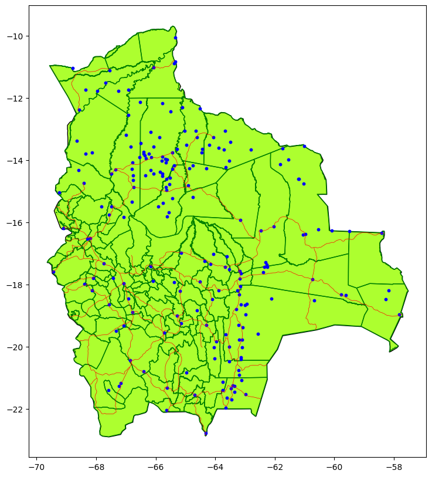

# Challenge 1: Bolivia Spacial Data 🇧🇴

### Alumno: Nicolas Silva Andujar (20200832)

Esta tarea consiste en la elaboración visual de mapas de Bolivia, que contienen información de las provincias, aeropuertos y carreteras del país. 

### Diccionario de datos 

| Variable     | Tipo     | Denominación                            | Valores                               |
|--------------|----------|-----------------------------------------|---------------------------------------|
|    COUNTRY   | geometry | Pais                                    |  Bolivia                              |
|   geometry   | geometry | Coordenadas geográficas                 |                                       |

### Elementos del mapa

| Elemento                  | Descripción                                                                                                                         |
|---------------------------|------------------------------------------------------------------------------------------------------------------------------------|
| **Puntos Azules**          | Representan las ubicaciones de los **aeropuertos** en Bolivia.  |
| **Líneas Rojas**           | Representan las principales **autopistas** que conectan diversas regiones de Bolivia  |
| **Contornos Verde Oscuro** | Delimitan las **provincias** de Bolivia. Estos contornos dividen el territorio en unidades administrativas subnacionales, mostrando la estructura geopolítica del país. |
| **Relleno Verde Claro**    | Representa el área geográfica de Bolivia, cubriendo tanto sus áreas urbanas como rurales.                                                                       |

