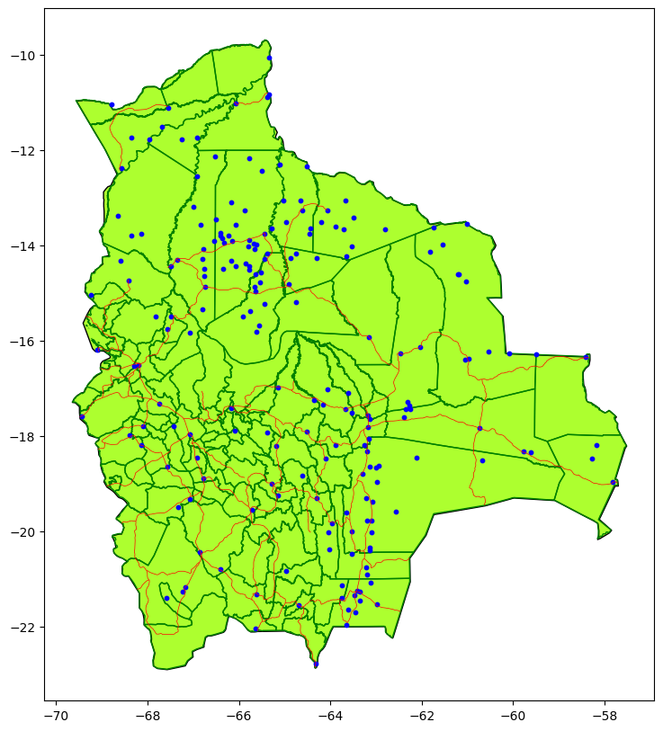

# Bolivia Spacial Data 🌍

### Alumno: Nicolas Silva Andujar (20200832)
---------------------------------------------------------------------------

Este repositorio consiste en la elaboración visual de mapas de Bolivia, que contienen información de las provincias, aeropuertos y carreteras del país. 

### **Contenido de la data** 📈
___
- **World_Countries**: Mapa con las fronteras y delimitaciones de todos los países del mundo
- **World_railroad**: Mapa con la distribución de los ríos a nivel mundial
- **provincia**: Mapa con la distribución geográfica de provincias en Bolivia
- **bo-airports.csv**: Mapa con la ubicación de los aeropuertos en Bolivia

___

### **Diccionario de datos** 📍

| **Variable**     | **Tipo**     | **Denominación**                            | **Valores**                               |
|--------------|----------|-----------------------------------------|---------------------------------------|
|    COUNTRY   | geometry | Pais                                    |  Bolivia                              |
|   geometry   | geometry | Coordenadas geográficas                 |                                       |

### **Leyenda** 🧭🗺️

| **Elemento**                  | **Descripción**                                                                                                                         |
|---------------------------|------------------------------------------------------------------------------------------------------------------------------------|
| **Puntos Azules**          | Representan las ubicaciones de los **aeropuertos** en Bolivia  |
| **Líneas Rojas**           | Representan las principales **autopistas** que conectan diversas regiones de Bolivia  |
| **Contornos Verde Oscuro** | Delimitan las **provincias** de Bolivia |
| **Relleno Verde Claro**    | Representa el **área geográfica** de Bolivia, cubriendo tanto sus áreas urbanas como rurales                                                                      |

___

**Enlace**: https://nicosil02.github.io/week2_spatial/Challenge2_NicolasSilva.html

**Enlace al archivo GeoPackage del mapa**: https://nicosil02.github.io/week2_spatial/data/boliviaMaps_4326.gpkg
